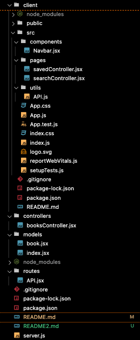
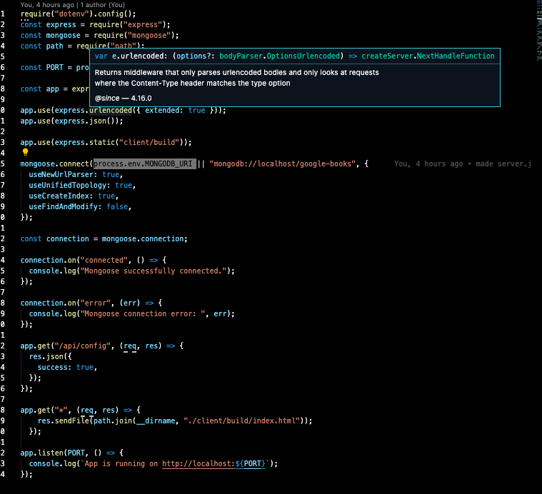
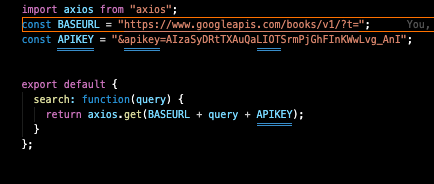
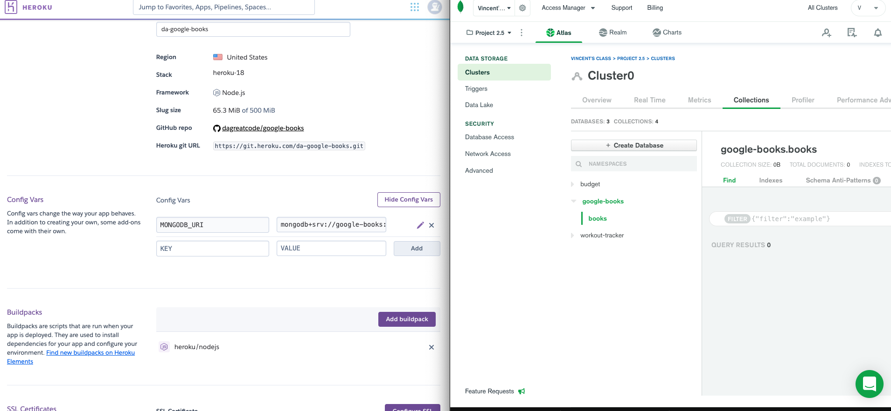
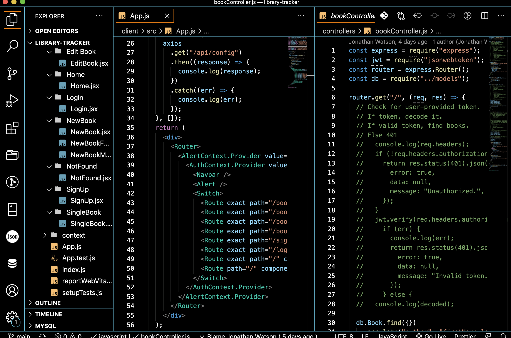

# Google Books Search
Click
[](https://da-google-books.herokuapp.com/)To Go.


REPO Link: 

[https://github.com/dagreatcode/google-books.git](REPO)

[](https://github.com/DaGreatCode/github-readme-stats)
# google-books (DB)
#
## I think my layout was great. Seems to get better....

#
## The server is always a no brain. Tricky when imputing a mongoose DB.

#
## AXIOS will always be easy. Tricky when using an KEY.

#
##

#
##

#
##

#
#

# Here is the link to the deployed Heroku Site. 
[Heroku](https://da-google-books.herokuapp.com/)
#
#
To Be A Master at this:
- [x] Awareness
- [x] Knowledge
- [ ] Skills
#
#
#
Some Git commands I can type faster then you:
```
git status
git add .
git commit -m ""
```

# :thinking: